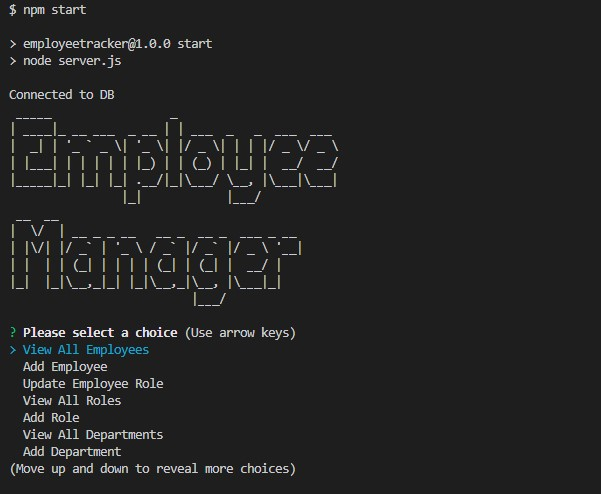

[](https://opensource.org/licenses/MIT)
# Employee Tracker 👨‍💼👩‍💼


## Description
This employee tracker is built using Javascript along with MySQL and Inquirer to be a simple CLI Employee Management System, capable of adding employees, altering roles, creating roles and departments and viewing all of this information. The backbone of this database is mysql which is queried using user input to produce the desired results. Challenges faced while making this were working with queries and mysql2 within the app. While building this I learned much about SQL queries and working with mysql within a node application.

### Table of contents
- [Description](#description)
- [Installation Instructions](#installation-instructions)
- [Usage Guidelines](#usage-guidelines)
- [Contact](#contact)

## Installation Instructions
To install, download the repo ```npm install``` and run using ```npm start```. Database needs to been initialized, run ``` SOURCE schema.sql ``` and ``` SOURCE seeds.sql ``` in the db directory to get the foundations laid. Be sure to created and edit your own .env file as well with appropriate username, password, and database name. 

## Usage Guidelines
Upon running ```npm start``` the client is presented with a welcome message and a list showing options. Pressing up and down on the arrow keys followed by Enter allow for client to select desired action and they will then be prompted with new questions to build out the content. 

* ### Screenshots



[Please Click Here for Youtube Demo](https://www.youtube.com/watch?v=bb9NI5Mexn8)

* ### Future Development
    * Converting all queries to promise queries --ATTEMPTED SEE database functions folder still getting the hang of it, feels wrong/too nested
    * Adding validation to inquirer 
    * Separating the functions out into varying files to control the size of this file
    * Add more functions to allow more versatility (to be done and submitted)

## Questions? Contact me

[Find me on GitHub](https://github.com/hburnton)

[Send me an email](mailto:hburnton@gmail.com)

[Project Page on Github](https://github.com/HBurnton/EmployeeTracker)

## License
This project licensed under the MIT license.
[Details on the MIT license](https://choosealicense.com/licenses/mit/)
